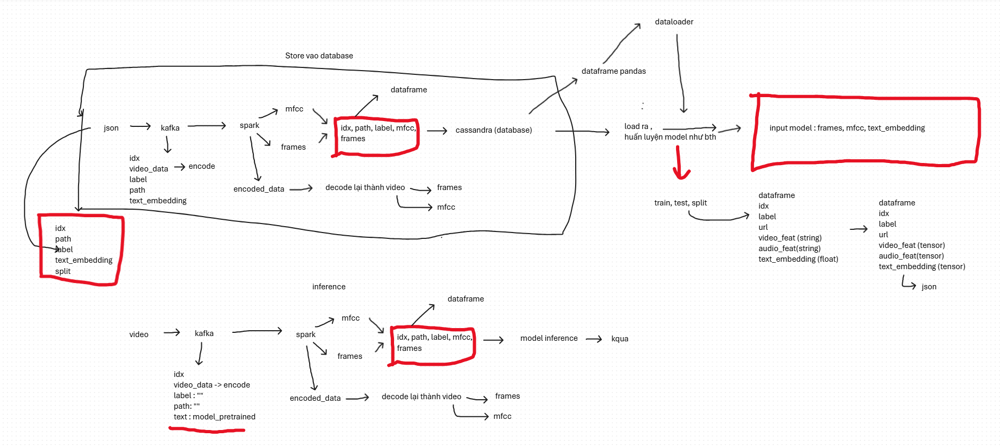

# **IMCOM 2026 - Real-Time Multimodal Detection of Harmful Videos in Vietnamese Online Platforms**  

## Overview
This repository contains a real-time multimodal system for detecting harmful video content on Vietnamese online platforms. The framework integrates visual, audio, and textual signals to enable robust and low-latency detection in streaming environments.

## Model Flow
The overall system architecture and inference pipeline are illustrated in the diagram below.

## Demo & Presentation 
Demo & Presentation videos demonstrating real-time detection results are available at:  
https://drive.google.com/drive/u/1/folders/1Kni1NSkH7kawjOoSSppYmDsMYt7TMu0f